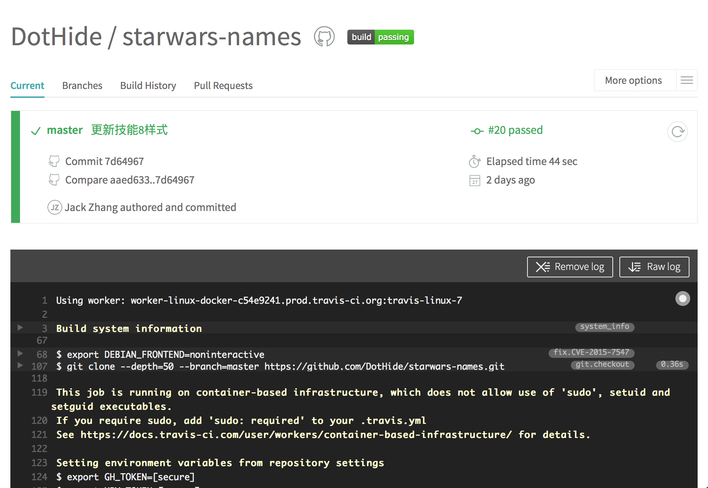
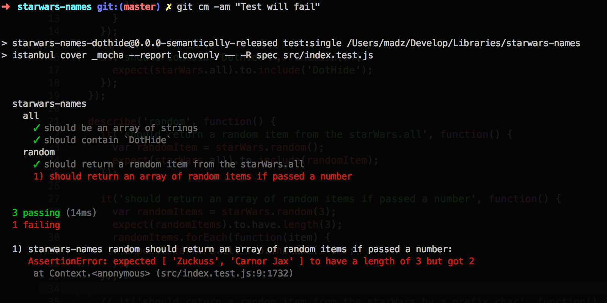

## StarWars Names

[](https://travis-ci.org/DotHide/starwars-names) [](https://codecov.io/github/DotHide/starwars-names?branch=master) [](https://www.npmjs.com/package/starwars-names-dothide) [](https://www.npmjs.com/package/starwars-names-dothide) [](https://www.npmjs.com/package/starwars-names-dothide) [](http://commitizen.github.io/cz-cli/)

GitHub 怎么用？Issue 还能通过 Commit 来同步关闭？版本号是怎么定义的？如何自动发行版本？Commit 还有公约和规范？怎样做持续构建？如何在提交之前就做测试？测试覆盖率是什么？……

也许在工作中您会遇到诸如此类的问题，不论您是菜鸟还是老手，但愿这篇文章能让你在其中找到一些有价值或可借鉴的东西，这源自一个教我学会「如何编写一个 JS 开源库」的实践项目，同时也让我领悟了许多开源项目的工程管理概念、思路及方法，包括 **版本管理、测试编写、自动版本发行、代码提交公约、持续构建（CI）、提交前测试、测试覆盖率及其报告** 等，总体感觉受益匪浅，在此对教程原文[[1]](#教程原文)表示感谢，并决定将视频中的大量知识通过写作记录下来，在学习过程中我也加入了一些自己的思考，将视频内容转换成了更通俗的语言，没时间看视频的朋友兴许可以瞧瞧这里，对于简单的技能可以跳过，相关技能的章节已做了电梯，可以直达进行阅读。**注意**：在您阅读任何技能章节之前建议您先看看[项目背景](#项目背景)，它非常简单，但它对您理解后面的内容很有帮助。

最后，如果您觉得本文有用，请您赏颗⭐️，文章中若有错误，也欢迎予以指正，非常感谢~

它让我学会了以下 **新技能（√）**：

* 【[技能 1](#技能-1-账户建立)】**账户建立**：建立 GitHub 及 npmjs 账号
* 【[技能 2](#技能-2-账户配置)】**账户配置**：配置 NPM，并构建第一个库
* 【[技能 3](#技能-3-代码提交)】**代码提交**：提交开源库至 GitHub  
  * 【[技能 3.1](#免密登录)】免密登录：无需每次输入密码登录 Linux 主机
* 【[技能 4](#技能-4-库发布)】**库发布**：将开源库发布到 [NPM Repo](https://www.npmjs.com)
* 【[技能 5](#技能-5-版本管理)】**版本管理**：包括版本号定义，版本标签及版本发行  
  * 【[技能 5.1](#版本号定义)】版本号定义：版本号每个数字的意义
  * 【[技能 5.2](#版本标签)】版本标签：为版本加标签发布至 GitHub
  * 【[技能 5.3](#版本发行)】版本发行：发布一个版本至 NPM
* 【[技能 6](#技能-6-单元测试)】**单元测试**：利用 Mocha 和 Chai 建立单元测试
* 【[技能 7](#技能-7-自动版本发行)】**自动版本发行**：利用 semantic-release 自动化发行
* 【[技能 8](#技能-8-代码提交公约)】**代码提交公约**：利用 commitizen 编写提交公约
* 【[技能 9](#技能-9-持续构建)】**持续构建（CI）**：利用 TravisCI 持续构建
* 【[技能 10](#技能-10-提交前测试)】**提交前测试**：利用 ghooks 做提交前自动化测试
* 【技能 11】**测试覆盖率1**：利用 Istanbul 做代码覆盖
* 【技能 12】**测试覆盖率2**：添加代码覆盖率报告
* 【技能 13】**GH特效**：在 README 中添加徽章
* 【技能 14】**ES6支持1**：添加 ES6 支持
* 【技能 15】**ES6支持2**：使用 Mocha & Babel 对测试添加 ES6 支持

### 项目背景
项目的名称叫 starwars-names，有两个非常简单的功能，但重点不在这里，重点是借助这样一个微型 JS 库（Micro JS Lib），向人们展示整个过程，使我们能应用到大型 JS 库（Huge JS Lib）中去：

1. 列出星球大战人物名（ all ） 
> 从 `starwars-names.json` 文件中取出所有人物名
2. 随机输出一个人物名（ random() ） 
> 从所有人物名中随机输出一个

最终，你可以这样使用它：
```js
starWarsNames = require('starwars-names');
console.log(starWarsNames.all);
// List All StarWars Names
[
  "4-LOM",
  "Aayla Secura",
  "Admiral Ackbar",
  ...

  "Zam Wesell",
  "Zayne Carrick",
  "Zuckuss"
]

console.log(starWarsNames.random());
// Output a random starWarsName
"Revan"
```

让我们开始吧，首先找个目录，建个文件夹并进入：`$ mkdir starwars-names && cd $_`

### 技能 1 账户建立
GitHub 账号作为新时代的必要装备散发着其迷人的光环，但是有账号和会用是两码事，所以这个光环能不能发挥作用取决于账号底下内容的丰富程度。看完这篇文章我相信会对 GitHub 账号有新的认识，至少对我而言是这样。此外，我们还需要建立 npmjs 账号，用于发布 NPM 包（最终我们的开源项目将能以 `$ npm install starwars-names` 的方式进行安装）。

#### GitHub 账户
访问 https://github.com/ ，注册 GitHub 账号，并新建代码库（+ New repository），名称填写为 starwars-names，并填写描述后得到如下页面的代码：
```shell
echo "# starwars-names" >> README.md
git init
git add README.md
git commit -m "first commit"
git remote add origin git@github.com:<yourUserName>/starwars-names.git
git push -u origin master
```

在项目目录中直接执行以上代码，进行首次提交，然后回头看项目的页面就编程代码了。

#### NPM 账户
访问 https://www.npmjs.com/ ，注册 NPM 账号。

### 技能 2 账户配置
#### 设置 GitHub 环境变量
其实主要有以下几项设置：
```bash
# 设置账户信息
$ git config --global user.name '<yourName>'
$ git config --global user.email '<yourEmail>'

# 设置命令别名
$ git config --global alias.st status
$ git config --global alias.cm commit
$ git config --global alias.co checkout
...
```
设置后，输入 `$ cat ~/.gitconfig` 可以查看设置情况

#### 设置 npm 环境变量
由于我们后面要做 `$ npm init` 来生成 `package.json` 文件，但文件中的许多变量设置可以通过 npm 环境变量来设置，以省去每次输入的麻烦。我们去 https://docs.npmjs.com/misc/config 找到 init- 开头的四个变量
```shell
$ npm set init-author-name "<yourName>"
$ npm set init-author-email "<yourEmail>"
$ npm set init-author-url "https://github.com/<yourUserName>"
$ npm set init-license "MIT"
# 关于 license 选择可以参看这篇博客(http://blog.jobbole.com/44175/)

# 然后在本地添加你的账号
$ npm adduser
Username: # 输入 NPM 账户名
Password: # 输入密码
Email: (this IS public) # 输入你的邮箱（会公开）
```
> 没有 npm 命令？去 [NodeJS](https://nodejs.org/en/) 上下载 Node

设置后，输入 `$ cat ~/.npmrc` 可以查看设置情况

#### 初始化 package.json
接着执行 `$ npm init`
```bash
...
Press ^C at any time to quit.
name: (starwars-names) # 默认回车
version: (1.0.0) # 默认回车
description: Get random StarWars Names
entry point: (index.js) # 建议改为 src/index.js
test command: # 暂无先留空
git repository: (https://github.com/<yourUserName>/starwars-names.git) # 提示你的 GitHub 库，回车
keywords: starwars random
license: (MIT) # 默认回车
... # 最后它会让你确认文件内容，并询问
Is this ok? (yes) # 回车后将在项目目录中建立 package.json
```

#### 增加第三方依赖库
由于刚才我们设置了 enter point，所以先建文件夹和 index.js 文件：`$ mkdir src && touch src/index.js`
我们的项目功能需要引用另一个库 unique-random-array，在此我们正好学习引用依赖（Adding an Dependency），因此需要先安装这个库：
```bash
$ npm install --save unique-random-array 
```

至此，文件结构如下：
```
starwars-names/               * 项目目录
├── node_modules/             * Node 依赖目录
│   └── unique-random-array/  * unique-random-array 依赖库
│       └── ...
├── src/                      * 代码目录
│   └── index.js              * 项目主文件
├── package.json              * NPM 配置文件
└── README.md                 * README 文件
```
#### 编写第一个库文件
在编辑 index.js 之前还需要创建一个数据文件 starwars-names.json，它的内容如下（已简化）：
```js
[
  "4-LOM",
  "Aayla Secura",
  "Admiral Ackbar",
  "Admiral Thrawn",
  // ...
  "Zam Wesell",
  "Zayne Carrick",
  "Zuckuss"
]
```

接着编辑 index.js 文件，它将会是这个样子：
```js
// src/index.js
var uniqueRandomArray = require('unique-random-array');
var starWarsNames = require('./starwars-names.json');

module.exports = {
  all: starWarsNames,
  random: uniqueRandomArray(starWarsNames)
}
```

保存后，如果我们想做个快速的测试，可以打开 node 命令行工具： `$ node `
```js
// node cli
> var lib = require('./src/index.js');
> lib.all
[
  "4-LOM",
  "Aayla Secura",
  "Admiral Ackbar",
  "Admiral Thrawn",
  ...
  "Zam Wesell",
  "Zayne Carrick",
  "Zuckuss"
]
> lib.random()
"Sebulba"
> lib.random()
"Jarael"

```

至此，我们完成了 NPM 的配置，并建立了第一个库文件，当前项目文件如下：
```
starwars-names/               * 项目目录
├── node_modules/             * Node 依赖目录
│   └── unique-random-array/  * unique-random-array 依赖库
│       └── ...
├── src/                      * 代码目录
│   ├── index.js              * 库主文件
│   └── starwars-name.json    * 数据文件
├── package.json              * NPM 配置文件
└── README.md                 * README 文件
```

### 技能 3 代码提交
这时，我们可以将现有的代码提交至 GitHub，不过在提交前我们需要先将你的机器跟 GitHub 做账号绑定（Adding SSH Keys to GitHub）：

* 首先打开 GitHub 网站并登陆，在右上角下拉选项中找到 Settings，然后找到左侧 SSH Keys，这时可以点击（New SSH Key）来添加你的钥匙。
* 输入 Title # 给钥匙起个名字，比如我的是：Jack's MBP
* 输入 Key # 这里有你想要的 Key 生成方法（https://help.github.com/articles/generating-an-ssh-key/）

保存后你的机器无需每次都输入账户密码即可提交代码了。

#### 免密登录
这个过程就如免密登录 Linux 主机的方法一样，这里简单扯几句。如果你希望访问某台 Linux 主机 / 服务器时不需要每次都输入密码，可以在该台机器上做如下操作：

* 建立 authorized_keys 文件 `$ touch ~/.ssh/authorized_keys`
* 然后将你刚才的 SSH Key 粘贴到这个文件里即可
* 当然访问权限取决于你的账户权限

这时你再用 `$ ssh <yourAccount>@<yourHost>` 时就能直接登录了

#### 代码提交
接着说代码提交，在提交前我们注意到 node_modules/ 这个文件夹是不需要做代码管理的，它是 npm 通过 package.json 文件自动生成的，因此我们可以将它忽略（使用 .gitignore文件），在项目根目录添加 `.gitignore` 文件，并加入一行 `node_modules` 即可。

* 我们先运行一下： `$ git status`，确认一下需要被提交的文件
* 然后将所有文件加入工作区： `$ git add .`
* 接着执行提交命令： `$ git commit -am '完成了功能 all 和 random'`
* 最后推送到 GitHub： `$ git push`

至此，我们完成了代码提交，项目结构如下：
```
starwars-names/               * 项目目录
├── node_modules/             * Node 依赖目录
│   └── unique-random-array/  * unique-random-array 依赖库
│       └── ...
├── src/                      * 代码目录
│   ├── index.js              * 库主文件
│   └── starwars-name.json    * 数据文件
├── .gitignore                * 登记 Git 代码忽略内容
├── package.json              * NPM 配置文件
└── README.md                 * README 文件
```

### 技能 4 库发布
现在我们可以把库发布到 NPM 上供别人下载了，具体步骤如下： `$ npm publish` 
> 但要注意的是 NPM 包名是全网唯一的，不能重复，因此我们需要修改 `package.json` 中的 `name` 属性，如："starwars-name-yourUserName"

发布后，我们可以通过 `$ npm info starwars-name-yourUserName` 来查看库的信息，如果显示类似如下的信息说明你的库已经发布成功了，你也可以通过该命令查看任何一个已有库的信息。
```js
{ name: 'starwars-names-dothide',
  description: 'Get random Star Wars names',
  'dist-tags': { latest: '1.3.0', beta: '1.2.0-beta.0' },
  versions: [ '1.0.0', '1.1.0', '1.2.0-beta.0', '1.2.0', '1.3.0' ],
  maintainers: [ 'dothide <dothide@gmail.com>' ],
  time:
   { modified: '2016-02-27T03:41:48.985Z',
     created: '2016-02-26T05:21:29.682Z',
     '1.0.0': '2016-02-26T05:21:29.682Z',
     '1.1.0': '2016-02-26T05:41:15.158Z',
     '1.2.0-beta.0': '2016-02-26T07:04:27.804Z',
     '1.2.0': '2016-02-26T08:28:15.093Z',
     '1.3.0': '2016-02-27T03:41:48.985Z' },
  homepage: 'https://github.com/DotHide/starwars-names#readme',
  keywords: [ 'random', 'starwars' ],
  repository:
   { type: 'git',
     url: 'git+https://github.com/DotHide/starwars-names.git' },
  author: 'DotHide <dothide@gmail.com> (https://github.com/DotHide)',
  bugs: { url: 'https://github.com/DotHide/starwars-names/issues' },
  license: 'MIT',
  readmeFilename: 'README.md',
  users: { dothide: true },
  version: '1.3.0',
  main: 'src/index.js',
  scripts:
   { commit: 'git-cz',
     'check-coverage': 'istanbul check-coverage --statements 100 --branches 100 --functions 100 --lines 100',
     'report-coverage': 'cat ./coverage/lcov.info | codecov',
     test: 'mocha src/index.test.js -w',
     'test:single': 'istanbul cover _mocha --report lcovonly -- -R spec src/index.test.js',
     'semantic-release': 'semantic-release pre && npm publish && semantic-release post' },
  dependencies: { 'unique-random-array': '1.0.0' },
  devDependencies:
   { chai: '3.5.0',
     codecov: '1.0.1',
     commitizen: '2.5.0',
     'cz-conventional-changelog': '1.1.5',
     ghooks: '1.0.3',
     istanbul: '0.4.2',
     mocha: '2.4.5',
     'semantic-release': '^4.3.5' },
  config:
   { commitizen: { path: 'node_modules/cz-conventional-changelog' },
     ghooks: { 'pre-commit': 'npm run test:single && npm run check-coverage' } },
  gitHead: '7857cc8bc4087ea35c230166f2cea5c673a82f93',
  dist:
   { shasum: '1031eda818e31ab00cee1036b75fdcf50eddef92',
     tarball: 'http://registry.npmjs.org/starwars-names-dothide/-/starwars-names-dothide-1.3.0.tgz' },
  directories: {} }
```

值得注意的是，其中的 `'dist-tags'` 中记录了当前最新的版本号和测试版本号，具体版本号定义将在下一篇讨论。

现在就可以通过 `$ npm install starwars-names-yourUserName` 来安装库到你的其他工程中去了。用法就同[项目背景](#项目背景)中描述的那样。

###  技能 5 版本管理
#### 版本号定义
标准版本号的基本格式如：`v1.0.0` ，其中的每个数字都有重要的意义：

* 第一个数字叫主版本（Major Version），主要用于革命性的更新，这种更新中往往含有许多的破坏性变化（BREAKING CHANGES）；
* 第二个数字是次要版本发布（Minor Release），主要用于增加新的特性（features），但不包含任何破坏性变化；
* 第三个数字是补丁发布（Patch Release），主要用于修复 BUGs。

测试版本号的基本格式如：`v1.2.0-beta.0` 它是在标准版本号的基础上增加测试版本类型和号码，一般测试类型可以分为两种，内测版和公测版：

* 内测版一般称为 alpha 版，可以写成：`v1.2.0-alpha.0`
* 公测的称为 beta 版，可以写成：`v1.2.0-beta.0`
* 主要注意的是，假如是基于 `v1.1.0` 上增加不成熟新功能（feature）的情况，那么该版本号应该定义为： `v1.2.0-beta.0` ，假如是基于 `v1.1.0` 上修复BUG，但不确定修复效果是否会让大众满意，就需要将版本号定义为： `v1.1.1-beta.0`
* 版本类型后面的数字是测试迭代版本号

#### 版本标签
我们需要将代码发布到 GitHub ，并给当前已完成的库打上标签（tag），具体如下：
```bash
$ git tag 1.0.0
$ git push --tags
```

我们打开 GitHub 项目主页，可以在 Tags 选项下找到 1.0.0 版本，另外 release 中也有了一条版本记录。

#### 版本发行
接着我们试图给当前的库增加一个新功能，这个功能非常简单，就是在 `starwars-names.json` 文件中插入一条数据（比如你的用户名），假设这实现了一个新的功能（feature），因此根据前面的版本号定义，我们需要相应地更新 `package.json` 文件中的 `version` 字段，接着为代码打一个新的标签，这次就是 `v1.1.0` ，注意我们还要，接着我们再重复一遍「版本标签」的步骤，并再做一次「库发布」，总的说来版本发行的步骤就是重复地按顺序做以下几件事：

```
1. 修改代码至确认无误（后面会说到测试，并利用相关工具在提交前测试）
2. 更新 package.json 的 version 字段
3. git add .
4. git cm -m "更新内容"
5. git tag <newVersionNo>
6. git push
7. git push --tags
8. npm publish
```

同样的，发布一个测试版本的步骤如下：
```
1. 修改代码
2. 更新 package.json 的 version 字段
3. git add .
4. git cm -m "更新内容"
5. git tag <newVersionNo>-beta.0
6. git push
7. git push --tags
8. npm publish --tag beta
```

相比之下，与发布正式版本的不同之处仅在于打标签时注意版本号定义，以及在 NPM 发布时加上 `--tag beta` 即可。

综上所述，不论是发布一个正式版本还是测试版本，都需要经过非常复杂的步骤流程，且中间不能出错，否则会引起版本混乱，这无疑给开发带来了新的问题和障碍，因此我们需要一个更好的工具来帮助我们完成以上重复劳动，不过在介绍工具之前，先把单元测试这篇做完。

### 技能 6 单元测试
这里我们将使用 Mocha 和 Chai 两款工具来做单元测试，首先先来安装：

```bash
$ npm i -D mocha chai # i=install -D=--save-dev
```

然后，我们在 src 文件夹中创建 `index.test.js` 文件，由于这里重点不是讲如何写测试，而是为后面的内容做测试环节的必要铺垫，因此直接晒文件内容了：
```js
// index.test.js
var expect = require('chai').expect;
var starWars = require('./index.js');

describe('starwars-names', function() {
  describe('all', function () {
    it('should be an array of strings', function () {
      expect(starWars.all).to.satisfy(isArrayOfStrings);
      function isArrayOfStrings(array) {
        return array.every(function(item) {
          return typeof item === 'string';
        })
      }
    });
  });

  describe('random', function () {
    it('should return a random item from the starWars.all', function () {
      var randomItem = starWars.random();
      expect(starWars.all).to.include(randomItem);
    });
  });
});
```

分别编写好两个功能的测试用例，然后在 `package.json` 文件中定义 test 脚本：
```js
{
  ...
  "scripts": {
    "test": "mocha src/index.test.js -w" // -w 就是 watch 实时观察
  },
  ...
}
```

这时我们就能利用 npm 命令行进行手动测试了： `$ npm test`
```mocha

  starwars-names
    all
      ✓ should be an array of strings
    random
      ✓ should return a random item from the starWars.all


  2 passing (8ms)
```

至此 2 条测试均已通过，再来看看现在的项目文件结构：
```
starwars-names/               * 项目目录
├── node_modules/             * Node 依赖目录
│   ├── chai/                 * Chai 依赖库
│   ├── mocha/                * Mocha 依赖库
│   ├── .../                  * 其他相关依赖库
│   └── unique-random-array/  * unique-random-array 依赖库
│       └── ...
├── src/                      * 代码目录
│   ├── index.js              * 库主文件
│   ├── index.test.js         * 测试文件
│   └── starwars-name.json    * 数据文件
├── .gitignore                * 登记 Git 代码忽略内容
├── package.json              * NPM 配置文件
└── README.md                 * README 文件
```

> Chai 的相关 API 文档可以查看这里（http://chaijs.com/api/）

### 技能 7 自动版本发行
很高兴你能阅读到里，同时也很高兴地告诉你「技能 5」中提到的版本发行过程将可以被更好地管理起来，你需要用到 semantic-release 这个工具。我们先来安装它： `$ npm i -D semantic-release-cli` 。

接着需要对它进行设置： `$ semantic-release-cli setup` ，你需要如实回答它的问题：
```bash
Is the GitHub repository private? (y/N) # 如果是开源库就直接回车，如果是私有库就输 y
What is your npm registry? (https://registry.npmjs.org) # 回车
What is your npm username? (<yourUserName>) # 由于之前配置过 NPM 因此这里会显示一些默认值，回车
What is your npm email? (<yourEmail>)
What is your GitHub username? (<yourUserName>)
What CI are you using? # 选择持续构建工具，一般选 Travis CI，如果有其他的可以选 Other
> Travis CI
> Travis CI Pro
> Travis CI Enterprise
> Other (prints token)
# 稍等片刻它会为我们配置 travis 相关信息，然后再提问

What kind of `.travis.yml` do you want?
> Single Node.js version.
> Multiple Node.js versions.
> Create no `.travis.yml`
# 选择需要在几个Node版本下测试，这里我们选择 Single Node.js version
```

然后我们回到项目目录，发现 `semantic-release` 为我们生成了 `.travis.yml` 文件，不过我们需要先来看一下 `package.json` 的变化，并添加几个重要的命令脚本：

* 首先，我们发现它删除了 verion 属性，因为这个属性后面将由它为我们自动管理，但这里我们仍然手动再添加一下，以免别人安装的时候系统会警告我们的库没有版本这个字段。
* 然后，它在 script 属性中为我们添加了一条新的脚本 `semantic-release` 

```js
// package.json
{
  ...
  "version": "0.0.0-semantically-released",
  "scripts": {
    "test": "mocha src/index.test.js -w",
    "test:single": "mocha src/index.test.js", // 我们在这里为 CI 单独建一条测试脚本
    "semantic-release": "semantic-release pre && npm publish && semantic-release post"
  },
  ...
}
```

我们再来看 `.travis.yml` 文件
```yml
sudo: false
language: node_js
cache:
  directories:
    - node_modules
notifications:
  email: false
node_js:
  - '4'
before_install:
  - npm i -g npm@^2.0.0
before_script:
  - npm prune
script:
  - npm run test:single # 我们在这里加入测试脚本，这样跑 CI 的时候就会自动做测试了
after_success:
  - npm run semantic-release
branches:
  except:
    - "/^v\\d+\\.\\d+\\.\\d+$/"
```

到这一步我们就完成了自动发布，但还不算完全做到自动版本发布，因为我们还需要另一个工具来为我们自动定义版本，请接着往下看。

### 技能 8 代码提交公约
上一篇最后提到的工具还有个非常重要的作用，就是「代码提交公约」，遵守了公约后，不仅能帮助我们自动识别版本，甚至还可以自动关闭 GitHub 上对应的 Issue，这样一来针对 Issue 的管理也会变得更容易和高效。它是 Angular 团队推荐使用的代码提交工具 `commitizen` 和 `cz-conventional-changelog` 具体可以参看 [Git Commit Guidelines](https://github.com/angular/angular.js/blob/master/CONTRIBUTING.md#-git-commit-guidelines) ，我们先安装它们：

```bash
$ npm i -D commitizen cz-conventional-changelog
```

然后修改 `package.json` 文件，添加 commit 脚本及配置：
```js
{
  ...
  "script": {
    "commit": "git-cz",
    ...
  },
  ...
  "config": {
    "commitizen": {
      "path": "node_modules/cz-conventional-changelog"
    }
  }
}
```

接着我们执行：`$ git status`，查看文件变化，并执行：`$ git add .` 将所有变化加入暂存区。此时，我们将使用：`$ npm run commit` 代替 `$ git commit -m ""` 来做提交。你也可以编辑 `~/.bashrc` 或 `~/.zchrc` 文件并在底部加入 `alias nrc='npm run commit'` 来创建快捷命令。

执行 `$ nrc` 后，系统需要回答以下问题：
```shell
Select the type of change that you are committing: 
> feat: 新特性（feature）提交
> fix: 修复 BUG 提交
> docs: 文档提交
> style: 代码风格修改提交（如：删除多余空格，代码格式化，增加缺失的分号等）
> refactor: 代码重构提交（既没有修复 BUG 也不是增加一个新功能，只是调整实现方式）
> perf: 提升性能的代码提交
> test: 添加测试提交
> chore: 修改构建过程、配置文件或者增加辅助工具和库时的提交
# 选择提交类型，将对应版本号的定义，这里我们选择 chore

Denote the scope of this change ($location, $browser, $compile, etc)
# 意思是本次提交的范围是什么（括号里指的是 Angular 库本身的相关代码范围，我们可以自定义自己库的有关范围，如针对某个方法的，就写类名-方法名，针对修改配置的，就写 config，针对代码发布的，就写 releasing 等。）
# 这里我们输入 Releasing

White a short, imperative tense description of the change:
# 大意是写一个简短的说明描述本次提交，可以留空，但建议填写

Provide a longer description of the change:
# 提供完整的提交描述，可以留空

List any breaking changes or issues closed by this change:
# 列出任何破坏性变更或本次提交解决的问题
# 我们可以打开 GitHub 手动新建一个 Issue，假如该 Issue 默认是第一个，我们在这里输入 Closes #1 就可以关联关闭该 Issue 了
# 如果想同时关闭多个 Issue，则可以输入 Closes #1, #2, #5
```

完成以上步骤后，我们输入：`$ git log` 来查看日志，发现最上面的一条记录了我们前面输入的内容

此时，我们可以直接 `$ git push` 提交，但为了再实践一次整个过程，我们可以在此时尝试给这个库增加一个新功能：给 random 增加一个数字传入参数，以输出给定数字个数的随机人物名。如：
```js
console.log(random(3));

// Output
[
  "Bossk",
  "Watto",
  "Natasi Daala"
]
```

利用 TDD 的思路，先从测试开始写起：
```
// index.test.js
  ...

  describe('random', function() {
    ...
    // 在 random 范围内增加一个新的测试用例
    it('should return an array of random items if passed a number', function() {
      var randomItems = starWars.random(3);
      expect(randomItems).to.have.length(3);
      randomItems.forEach(function(item) {
        expect(starWars.all).to.include(item);
      });
    });
  }
  ...
```

然后我们执行： `npm t`，显然测试将报错，接着写实现：
```js
// index.js
var uniqueRandomArray = require('unique-random-array');
var starWarsNames = require('./starwars-names.json');
var getRandomItem = uniqueRandomArray(starWarsNames);

module.exports = {
  all: starWarsNames,
  random: random
}

function random(input) {
  if (input === undefined) {
    return getRandomItem();
  } else {
    var randomItems = [];
    for (var i = 0; i < input; i++) {
      randomItems.push(getRandomItem());
    }
    return randomItems;
  }
}
```

写完后，测试顺利通过！这时就能再实践一次上面的过程了，我们无需考虑版本的变化，无需考虑要在哪里写版本日志，所有的一些都交给工具完成，我们执行：`$ nrc`，又是刚才的问题，只是在第一步我们选择 **feat** ，后面随意发挥，当然也可以再新建两个 Issue 试试，我们将在下一章「持续构建」里 Push 代码  :)

### 技能 9 持续构建
OKey，很高兴你能坚持到这里，让我们继续，所谓的持续构建，通俗地说就是持续不断地从零开始为你项目新版本做构建或集成，在本例中表现为每 push 一个新版本到 GitHub ，它就为你从零开始构建，包括从安装 NPM 库开始，到安装依赖，再到跑测试，若测试成功的话，就会做版本发布（NPM publish）等等的一整套流程（这个流程可以在配置文件中定义），本项目的持续构建使用 Travis-CI 提供的服务。

现在我们 PUSH 项目代码到 GitHub，`$ git push` 。

完成后，我们访问 http://travis-ci.org/ 网站并登录 GitHub 账号查看，可以发现它已经自动开始为我们工作了。



> 一般情况下，我们每次 push 代码后，1~3 分钟内它就会自动为我们做 CI 了

所有配置都在 `.travis.yml` 文件中，还记得吗？它是由 semantic-release 生成的
```yml
sudo: false
language: node_js
cache:
  directories:
    - node_modules
notifications:
  email: false
node_js:
  - '4'
before_install: # 构建前需要安装的内容
  - npm i -g npm@^2.0.0
before_script: # 构建前需要执行的脚本
  - npm prune
script: # 构建时执行的脚本
  - npm run test:single # 我们在这里加入测试脚本，这样跑 CI 的时候就会自动做测试了
after_success: # 构建成功后执行的脚本
  - npm run semantic-release 
branches:
  except:
    - "/^v\\d+\\.\\d+\\.\\d+$/"
```

其实文件中还能添加许多配置项，如：
```yml
install: # 运行时需安装的
after_failure: # 构建失败后执行的脚本
before_deploy: # 部署前（可选）
deploy: # 部署时（可选）
after_deploy: # 部署前（可选）
```

#### 限制构建分支
上例中的 branches: 配置项是指定需要进行构建的分支：
```yml
# 黑名单（指定的分支不会被构建）
branches:
  except: 
    - legacy
    - experimental

# 白名单（只有指定的分支会被构建）
branches:
  only:
    - master
    - stable
```

> 具体配置文件的编辑说明可以查看 Travis CI 的官方文档：https://docs.travis-ci.com/user/customizing-the-build/

### 技能 10 提交前测试
接下来我们聊一聊提交前测试，也就是在每次 commit 之前系统会根据测试脚本跑一遍测试，如果全部通过了才执行提交任务。我们将使用 ghooks 工具来做这件事。首先，我们来安装它：
```bash
$ npm i -D ghooks
```

然后，在 `package.json` 文件中进行配置
```js
// package.json
...
"config": {
  "ghooks": {
    "pre-commit": "npm run test:single" // 配置测试脚本
  }
}
...
```

此时，我们可以来实验一下，假设我们去修改一下 random 方法中的一些内容，导致测试不能通过，例如：
```js
// index.js
...
function random(input) {
  if (input === undefined) {
    return getRandomItem();
  } else {
    var randomItems = [];
    // 修改输出的个数，这将导致测试失败
    for (var i = 1; i < input; i++) {
      randomItems.push(getRandomItem());
    }
    return randomItems;
  }
}
```

然后我们直接执行：`$ git commit -am "Test will fail!"` ，此时测试就不能通过，且提交行为终止。



好了，我们将代码改回来，然后再练习一遍标准提交流程吧~

### 技能 10 测试覆盖率 1
我理解的测试覆盖率就是我们前面所写的测试代码对整体程序的覆盖面，有点辩证逻辑的感觉在里面，意思就是正过来要对，反过来也要不出错。测试覆盖率我们常用的工具是 Istanbul，很有意思的名字，从[阮一峰的博客](http://www.ruanyifeng.com/blog/)中学习到，伊斯坦布尔是土耳其的最大城市，因土耳其地毯世界闻名，然而地毯又是用来覆盖的，所以才有这样一个名字。

接着，我们先安装 Istanbul，`$ npm i -D istanbul` ，然后我们再次编辑 `package.json` 文件，修改原来的 `test:single` 脚本，将原来直接使用 `mocha` 命令改为使用 istanbul 提供的 `_mocha` 命令来执行测试脚本：

```json
"test:single": "istanbul cover _mocha src/index.test.js"
```

修改后，我们先来执行一下看看 `$ npm run test:single` 

```
> istanbul cover _mocha src/index.test.js


  starwars-names
    all
      ✓ should be an array of strings
      ✓ should contain `DotHide`
    random
      ✓ should return a random item from the starWars.all
      ✓ should return an array of random items if passed a number
      ✓ should return a random item from the starWars by a prefix char
      ✓ should throw an error if you enter char > 1


  6 passing (16ms)

=============================================================================
Writing coverage object [/Users/madz/Develop/Libraries/starwars-names/coverage/coverage.json]
Writing coverage reports at [/Users/madz/Develop/Libraries/starwars-names/coverage]
=============================================================================

=============================== Coverage summary ===============================
Statements   : 100% ( 45/45 )
Branches     : 100% ( 8/8 )
Functions    : 100% ( 16/16 )
Lines        : 100% ( 45/45 )
================================================================================
```

Great! ~ ：）

### 教程原文
[1] [《How to Write an Open Source JavaScript Library》](https://egghead.io/series/how-to-write-an-open-source-javascript-library) by [Kent C. Dodds](http://kentcdodds.com)